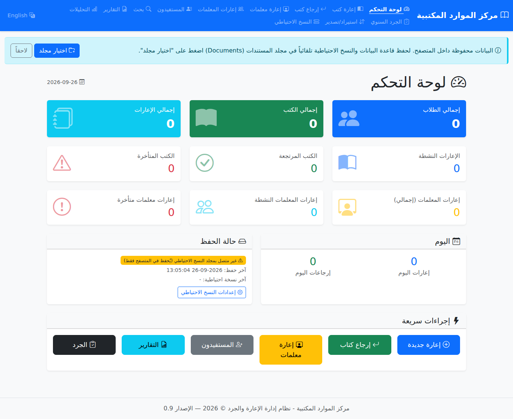

# LRC System — Library Loan & Inventory Management

**Single-file, offline, bilingual (Arabic / English) library system for school Learning Resource Centers.**

[-lightgrey)](#)

**Language / اللغة:** English · [العربية](README.ar.md)

---

## What it is

`LRC_System.html` is the whole application in **one HTML file** (~2.3 MB). It combines the previous
loan-management web app and the barcode inventory tool. There is no server, no installation and no
internet connection needed — double-click the file and it opens in Chrome or Edge.

## Quick start

1. Download this repository (green **Code ▸ Download ZIP** button, or `git clone`) and extract it anywhere on the PC — or copy just `LRC_System.html`.
2. Double-click **`START_LRC.bat`**, or open `LRC_System.html` directly in Google Chrome / Microsoft Edge.
3. Click **Choose folder** in the blue banner and pick your **Documents** folder.
   The database and all backups are then written there automatically (see below).
4. Import the students and books lists from CSV (Import/Export page) — or restore a previous
   `lrc_library.db` file.

## Features

| Area | Details |
|---|---|
| **Loans by barcode** | Lend by the book's general number with a barcode reader. Leading zeros are ignored (`00045` = `45`). |
| **Warnings, not blocks** | A student with unreturned books gets a visible warning; more than 3 books in one day triggers a warning — lending is still allowed in both cases. |
| **Returns** | Scan the book barcode (instant return with undo) or search by student name and return selected / all. |
| **Members** | Add, edit or delete students and teachers manually at any time, or import from CSV. |
| **Teacher loans** | Separate register for teachers and events, with its own active list. |
| **Reports** | Date range from / to; for everyone, per class / section, or per student; CSV export and print. |
| **Inventory** | Annual barcode inventory with multi-copy books, damaged and out-of-list books, progress, resume, and full reports/exports. |
| **Search & analytics** | Universal search; monthly trends, top borrowers, popular titles, loans by class, overdue analysis. |
| **Bilingual** | Arabic (RTL, default) and English, switchable from the menu. |

## Where your data lives

| Location | When | What |
|---|---|---|
| Browser storage (IndexedDB) | always | A copy of the SQLite database, saved after every change. |
| `Documents\LRC_Library\lrc_library.db` | after you choose a folder | The database file, rewritten after every change. |
| `Documents\LRC_Library\backups\lrc_backup_<date>_<reason>.db` | automatic | Every 50 save operations, once a day on first launch, before any restore or reset, and on demand. Old backups are pruned (default: keep 40). |
| `Documents\LRC_Library\backups\csv_<date>\` | on demand ("Full backup") | students, books, teachers, loans, teacher loans and inventory as CSV. |

- On start the app compares the browser copy with the folder file; the **newer one wins** and the other is kept as a backup.
- On later launches the browser may ask for a one-click **Reconnect**.
- Without a folder, automatic backups fall back to browser downloads.
- One active PC per data folder at a time.

## Importing CSV files from Excel (Arabic text)

Excel on Arabic Windows saves *CSV (Comma delimited)* as **Windows-1256** and *Unicode Text* as
**UTF-16 with tabs**. The import page:

- detects the encoding (UTF-8, UTF-16, Windows-1256, ISO-8859-6) and the delimiter (`,` `;` or tab),
- shows a **preview of the first 5 rows** so you can confirm the Arabic is correct before importing,
- lets you override the encoding manually,
- can **update existing records** (tick the box) to repair names or titles that were imported garbled earlier.

Required columns: students `stNumber, stName, stClass, stSec` — books `Gnumber, BookTitle`
(a repeated number inside the file means an extra physical copy).

### Sample data (`samples/`)

| File | Content |
|---|---|
| `students_sample.csv` | 24 students with Omani names in classes **4/1, 4/2, 5/1, 5/2, 6/1, 6/2**. Enter the grade in `stClass` and the section in `stSec` (`4` and `1`), the app shows it as **4 / 1**. |
| `books_sample.csv` | 40 Omani titles (novels, history, heritage, children's books). Number `1` appears twice, so it imports as one title with two copies. |

Use them to try the app, then import your own lists with the same column names.

## Browser support

Google Chrome or Microsoft Edge (current versions) are recommended: they support saving directly into
the Documents folder. Other browsers run the app but only keep data in browser storage and download backups.

## Security

- Hash-based Content-Security-Policy: only the embedded scripts can run, no network access at all.
- All output is HTML-escaped; all database access uses bound parameters; CSV exports neutralise formula injection.
- Static analysis (Semgrep, 328 rules) and dynamic testing (Playwright/Chromium, 145 automated checks
  including XSS, CSP, SQL/CSV injection and backup scenarios) are documented in the project's `security/` folder.

## Credits

Built with [Bootstrap](https://getbootstrap.com/) 5.3, [Bootstrap Icons](https://icons.getbootstrap.com/) 1.13,
[Chart.js](https://www.chartjs.org/) 4.5 and [sql.js](https://sql.js.org/) 1.13 (SQLite compiled to WebAssembly) — all MIT licensed.
